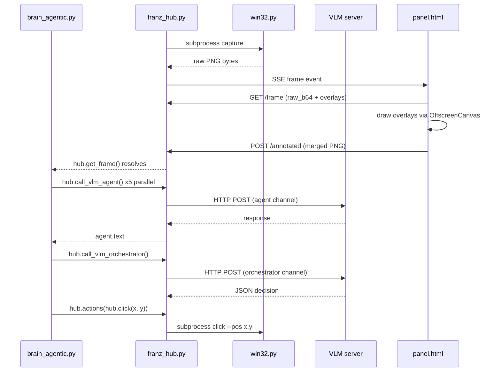
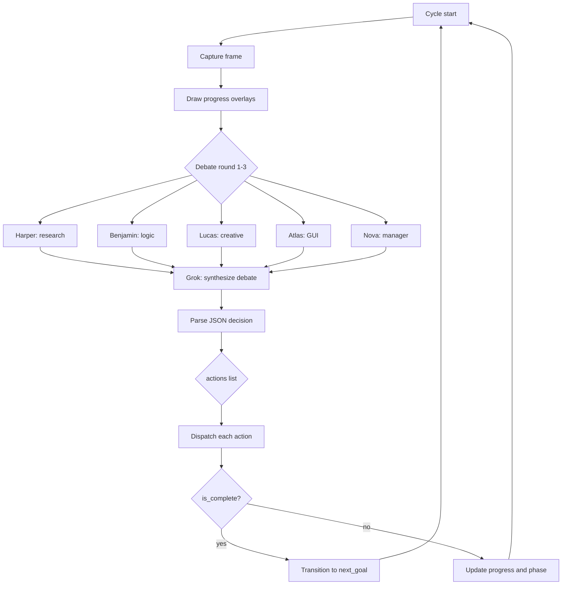
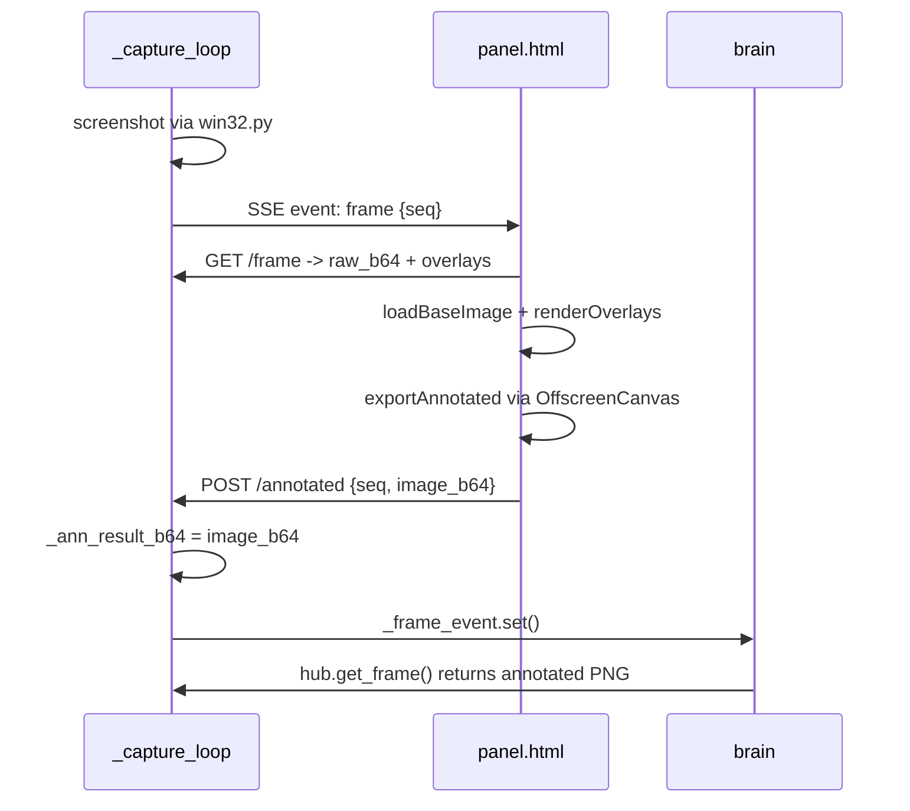

# Franz

A Windows computer-use AI swarm that captures the screen, runs a multi-agent debate, and executes input actions to complete arbitrary tasks.

---

## Architecture

```
┌─────────────────────────────────────────────────────────────┐
│                        franz_hub.py                         │
│  HTTP server  |  asyncio loop  |  SSE bus  |  action queue  │
└────────┬──────────────┬────────────────┬────────────────────┘
         │              │                │
   brain_agentic.py   win32.py       panel.html
   (intelligence)   (subprocess)    (Chrome UI)
```

### Component roles

| File | Role |
|---|---|
| `franz_hub.py` | Motherboard. Pure plumbing. Routes strings, executes actions, owns all queues and the HTTP server. Makes zero decisions. |
| `brain_agentic.py` | Intelligence. 5-agent debate swarm + captain. All VLM calls and action decisions live here. |
| `win32.py` | Standalone CLI subprocess. Screen capture via GDI, all mouse/keyboard input via Win32 API. |
| `panel.html` | Single-file Chrome UI. Annotates frames, streams swarm wire, renders overlays. |
| `config.json` | All tuneable values. Read at runtime via `hub.cfg()`. |

---

## Data flow



---

## Swarm loop



---

## Coordinate system

All coordinates are normalized integers in the range `0-1000` mapping to the configured capture region.

```
screen pixels  <-->  norm 0-1000  <-->  panel canvas pixels
```

`win32.py` converts norm coords to real screen pixels using the capture region bounds.
The panel scales the same 0-1000 space to canvas dimensions when rendering overlays.

---

## Annotation pipeline



---

## VLM channels

Two independent semaphores prevent agent calls from blocking the captain.

| Channel | Semaphore key | Default |
|---|---|---|
| Orchestrator (Grok) | `max_orchestrator_vlm_concurrent` | 1 |
| Agent (Harper..Nova) | `max_agent_vlm_concurrent` | 5 |

---

## HTTP API

| Method | Route | Description |
|---|---|---|
| GET | `/` | Serves `panel.html` |
| GET | `/events` | SSE stream (primary data channel) |
| GET | `/frame` | Current raw frame + overlays JSON |
| POST | `/annotated` | Panel submits merged annotated PNG |
| GET | `/state` | Snapshot: frame_seq, agents, swarm_count |
| GET | `/swarm?after=N` | Swarm messages from index N |
| GET | `/swarm_image/{idx}` | Image attached to swarm message idx |
| GET | `/config` | Current config |
| POST | `/config` | Update and persist config |
| GET | `/event_log` | Last 200 event log entries |

---

## Configuration

All values in `config.json`, accessed via `hub.cfg(key, default)`.

| Key | Default | Description |
|---|---|---|
| `server_host` | `127.0.0.1` | HTTP bind address |
| `server_port` | `1234` | HTTP port |
| `vlm_endpoint_url` | | OpenAI-compatible chat completions URL |
| `vlm_model_name` | | Model identifier sent in request body |
| `vlm_timeout_seconds` | `120` | Per-request timeout |
| `vlm_request_delay_seconds` | `0` | Delay between VLM calls |
| `max_orchestrator_vlm_concurrent` | `1` | Orchestrator semaphore |
| `max_agent_vlm_concurrent` | `5` | Agent semaphore |
| `max_parallel_agents` | `1` | Agent task concurrency |
| `capture_region` | | Norm coords `x1,y1,x2,y2` or empty for full screen |
| `capture_width` | `640` | Output PNG width |
| `capture_height` | `640` | Output PNG height |
| `capture_interval_seconds` | `3.0` | Max time between captures |
| `action_delay_seconds` | `0.15` | Delay between dispatched actions |
| `show_cursor` | `true` | Render cursor crosshair overlay |
| `cursor_color` | `#ff4444` | Cursor overlay color |
| `cursor_arm` | `14` | Cursor crosshair arm length in norm units |
| `brain_file` | `brain_agentic.py` | Brain module filename |
| `log_to_disk` | `true` | Write session logs and frames to disk |
| `log_dir` | `logs` | Directory for session logs |

---

## Brain API contract

The brain receives the hub module as its only argument. All interaction goes through it.

```python
async def main(hub: ModuleType) -> None: ...
```

### Actions (enqueue via hub.actions)

```python
hub.actions(hub.click(x, y))
hub.actions(hub.double_click(x, y))
hub.actions(hub.right_click(x, y))
hub.actions(hub.type_text("text"))
hub.actions(hub.press_key("enter"))
hub.actions(hub.hotkey("ctrl+c"))
hub.actions(hub.scroll_up(x, y))
hub.actions(hub.scroll_down(x, y))
hub.actions(hub.drag(x1, y1, x2, y2))
```

### Overlays

```python
hub.overlays(hub.dot(x, y, label, color))
hub.overlays(hub.box(x1, y1, x2, y2, label, stroke_color, fill_color))
hub.overlays(hub.line(points, label, color))
```

All overlay dicts must include `closed`, `stroke`, and `fill` keys.

### VLM

```python
await hub.call_vlm_agent(messages, temperature=0.5, max_tokens=512, agent_name="Harper")
await hub.call_vlm_orchestrator(messages, temperature=0.2, max_tokens=800, agent_name="Grok")
```

### Utilities

```python
hub.cfg(key, default)
hub.log_event(text, level)        # level: info | ok | warn | error
hub.set_agent_status(agent, status)  # idle | awaiting_vlm | thinking | acting | error
hub.swarm_message(agent, direction, text, image_b64, system)
await hub.get_frame()             # returns annotated PNG as base64 string
hub.request_fresh_frame()
```

---

## win32.py CLI

Called exclusively as a subprocess by `franz_hub.py`. Never imported.

```
python win32.py capture       --region x1,y1,x2,y2  --width 640  --height 640
python win32.py click         --pos x,y              --region ...
python win32.py double_click  --pos x,y              --region ...
python win32.py right_click   --pos x,y              --region ...
python win32.py type_text     --text "..."
python win32.py press_key     --key enter
python win32.py hotkey        --keys ctrl+s
python win32.py scroll_up     --pos x,y              --region ...  --clicks 3
python win32.py scroll_down   --pos x,y              --region ...  --clicks 3
python win32.py drag          --from_pos x,y         --to_pos x,y  --region ...
python win32.py cursor_pos    --region ...
python win32.py select_region
```

`select_region` opens a fullscreen transparent overlay. Drag to select, right-click for full screen, Escape to cancel. Outputs norm coords `x1,y1,x2,y2` to stdout and exits 0, or exits 2 on cancel.

---

## Running

```
python franz_hub.py
```

Optional flags:

```
--brain <filename>   Override brain_file from config
--skip-region        Skip the region selection dialog
```

On startup:
1. Loads `config.json`
2. Prompts for capture region via `select_region` overlay (unless `--skip-region`)
3. Loads the brain module
4. Starts HTTP server on `server_host:server_port`
5. Opens asyncio loop and calls `brain.main(hub)`

Open `http://127.0.0.1:1234` in Chrome to connect the panel.

---

## Requirements

- Windows (Win32 API required)
- Python 3.13+
- Google Chrome (for panel)
- An OpenAI-compatible chat completions endpoint (local or remote)
- No third-party Python packages (stdlib only: `ctypes`, `asyncio`, `http.server`, `subprocess`, `zlib`, `struct`)

---

## Session logging

When `log_to_disk` is true, each run creates a timestamped directory under `log_dir`:

```
logs/
  20250101_120000_000000/
    events.txt        <- all log_event and action entries
    20250101_120001_000000.png
    20250101_120004_000000.png
    ...
```

---

## Coding rules

- The brain makes all decisions. `franz_hub.py` makes none.
- All action helpers return dicts and have no side effects. Side effects happen only when the dict is passed to `hub.actions()`.
- `hotkey` takes one joined string: `"ctrl+c"`, never a list.
- `scroll_up` / `scroll_down` take `(x, y)` only, no clicks parameter at brain level.
- `drag` takes `(x1, y1, x2, y2)`, no `drag_start` / `drag_end`.
- Coordinates are always norm integers `0-1000`.
- No emojis, no non-ASCII characters anywhere.
- No hardcoded endpoints, ports, or model names in the brain; use `hub.cfg()`.
- SSE is primary; fallback polling activates only after SSE failure.
